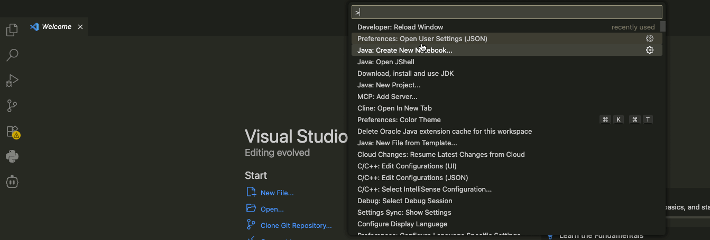
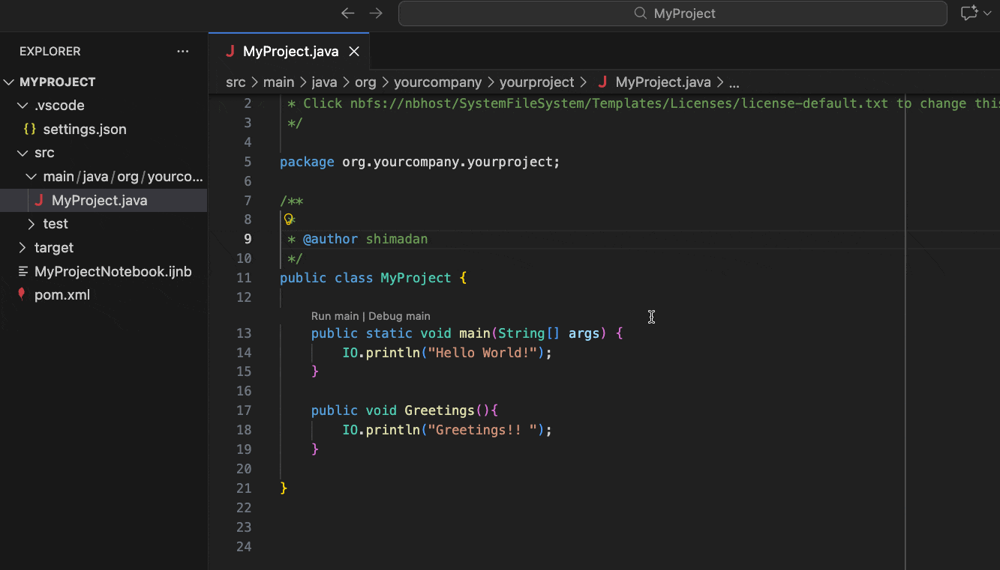
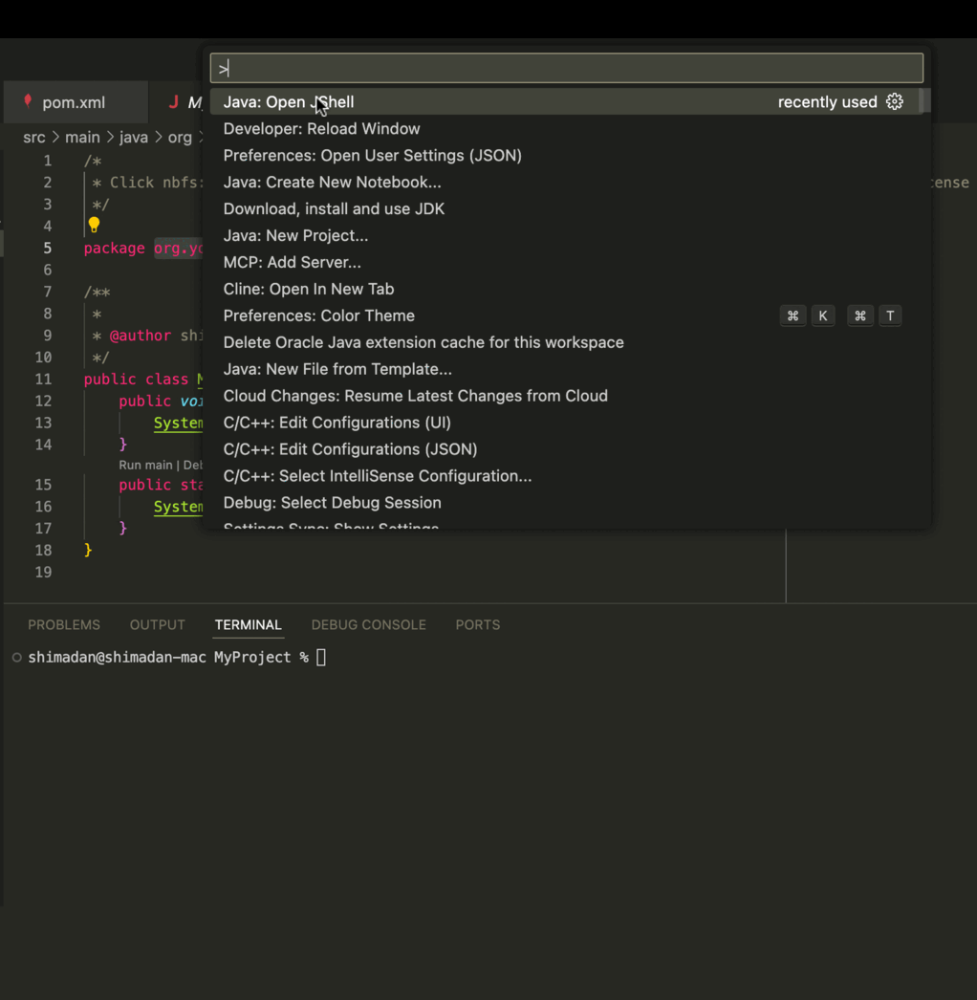
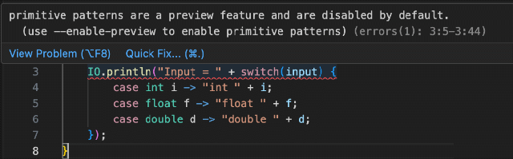
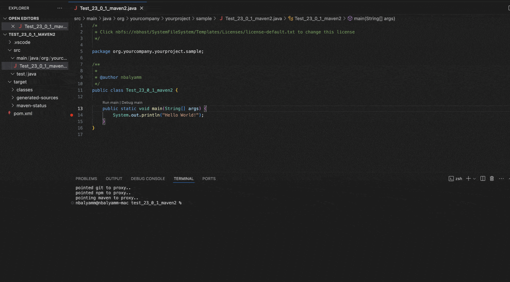

<!--

Copyright (c) 2023-2025, Oracle and/or its affiliates.

    Licensed to the Apache Software Foundation (ASF) under one
    or more contributor license agreements. See the NOTICE file
    distributed with this work for additional information
    regarding copyright ownership. The ASF licenses this file
    to you under the Apache License, Version 2.0 (the
    "License"); you may not use this file except in compliance
    with the License. You may obtain a copy of the License at
    
       http://www.apache.org/licenses/LICENSE-2.0
    
    Unless required by applicable law or agreed to in writing,
    software distributed under the License is distributed on an
    "AS IS" BASIS, WITHOUT WARRANTIES OR CONDITIONS OF ANY
    KIND, either express or implied. See the License for the
    specific language governing permissions and limitations
    under the License.

-->

<!-- This file has been modified for Oracle Java Platform extension -->

# Java Platform Extension for Visual Studio Code

Java Platform extension from Oracle brings full-featured development support (edit-compile-debug & test cycle) to VS Code. It also offers support for Maven and Gradle projects. Applications using JDK 8 and above are supported.

## Getting Started
1. See the [VS Code Tips](https://github.com/oracle/javavscode/wiki/VS-Code-Tips) wiki for a quick primer on getting started with VS Code.
2. Setting up the JDK
    - If no JDK is present in your system then the extension can set things up for you. For more details refer to [JDK Downloader](#jdk-downloader) section.
    - Set the VS Code `Settings | Jdk: Jdkhome` setting to point to the JDK that the Language Server will run on and also by default use for running and compiling projects.
        - The extension requires JDK 17 or newer to run.
    - Optionally, set a different JDK to compile and run projects in the `Settings | Jdk › Project: Jdkhome` setting.
        - By default, the __jdk.jdkhome__ setting is used. 
        - Projects can run on JDK 8 and above.  
    - For more information, see the section [Selecting the JDK](#selecting-the-jdk).
3. Use any one of the following ways to start coding, compiling and debugging in Java.
    - Simply create a new Java class with `main` method.
    - Use the __Java: New File from Template...__ command to create a new Java file.
    - Use the __Java: New Project...__ command to create a new project.
    - Open the folder with existing __Maven__ or __Gradle__ project files (_pom.xml_ or _build.gradle, gradle.properties_).

## Supported Actions
In the VS Code command palette:
* __Java: New Project...__ allows creation of new Maven or Gradle project 
* __Java: New File from Template...__ adds various files to the currently selected open project. Files are:
    * Java - broad selection of various predefined Java classes
    * Unit tests - JUnit and TestNG templates for test suites and test cases
    * Other - various templates for Javascript, JSON, YAML, properties, ... files
* __Java: Create New Notebook...__ command to create a new [Java notebook](#interactive-java-notebooks) (`.ijnb` file)
* __Java: Open JShell...__ command to open [JShell](#jshell).
* __Java: Compile Workspace__ - invoke Maven or Gradle build
* __Java: Clean Workspace__ - clean Maven or Gradle build
* __Download, install and Use JDK__ - allows download and installation of JDK binaries 
* Debugger __Java+...__ - start main class or test on selected JDK. More in [Debugger section](#debugger-and-launch-configurations)
* __Test Explorer__ for Java tests results visualization and execution including editor code Lenses.
* Maven and Gradle support including multi-project projects, subprojects opening and Gradle priming builds.
* __Java: Go To Test/Tested Class__ - Navigates to the corresponding test or source class file

## Project Explorer
Project Explorer provides an overview of logical project structure, groups sources together and greatly simplifies Java package structure exploration. Project Explorer is an addition to the classical workspace explorer. Use it to build, test, execute and operate your Maven and Gradle Java projects. 

## Interactive Java Notebooks
### Introduction
* Experience interactive coding with Java notebooks. See the [Using Interactive Java Notebooks](https://github.com/oracle/javavscode/wiki/Interactive-Java-Notebooks) wiki for guidance and tutorials on using notebooks.
* Use the __Java: Create New Notebook...__ command to create a new Java notebook (`.ijnb` file) 
    
* Add code snippets with `+ Code` button and document with markdown cells using the `+ Markdown` button.
* Double-click on a cell to edit and press `Esc` when done.
* Jupyter-style notebooks let you combine Java code snippets with markdown-formatted text cells.
* Run individual code cells or execute the entire notebook.
* Save outputs alongside code cells.
* **Sharing notebooks:**
    * Share as `.ijnb` files for use with the Oracle Java extension.
    * Rename with a `.ipynb` extension for viewing in other IDEs, such as Jupyter.
* Download the [sample notebooks](https://github.com/oracle/javavscode/blob/main/samples/notebooks) and open them in VS Code to get started.

### Java Notebooks for Java Projects
* Document Java projects with interactive Java notebooks.
    * Open or create a Java notebook in your workspace folder loaded with classes from your project. 
    
    * Use the `Project Context` options to switch to a different project context. 
    
* Provide code snippets, markdown explanations, and expected outputs.

### Notebook Configurations
The following configuration settings are available:
* `jdk.notebook.classpath`
* `jdk.notebook.modulepath`
* `jdk.notebook.addmodules`
* `jdk.notebook.enablepreview`
* `jdk.notebook.implicitimports`

These settings *override* settings inferred from project context.

## JShell
* Use the __Java: Open JShell...__ command to open JShell.
* Project classes from currently open project are automatically loaded. 

## Debugger and Launch Configurations
Language Server __Java+ ...__ launch configuration supports debugging and running Java applications using JDK11 or newer. 
1. The launch configuration (debugger) is invoked when `Run main | Debug main` codelens is selected in the code.
2. Or __Java+...__ is selected in __Run and Debug__ activity panel. 

### Launch Configurations
* __Launch Java App__ - Debug or Run current Java project
* __Attach to Port__ & __Attach to Process__ - Attach debugger actions. Available when __Java+ ...__ at the bottom of drop down list is selected.
    * Select this configuration, then click the  button.
    * Select either from available process or enter the port to connect to JVM running with JDWP.
    * __Attach to Shared Memory__ is available on Windows in addition to above mentioned _Attach..._

Default launch configurations provided by Language Server can modified in `launch.json` file.

### Run Configurations panel
Program arguments, VM options, environment variables, etc., can be set in the Run Configuration panel as part of Explorer. The panel is sufficient for all typical use-cases Java programmer faces. Only advanced, expert scenarios may require touching of `launch.json` (which still takes precedence). 
 

## JDK Downloader
If the system does not detect any JDK, the extension will offer a downloader and setup prompt to help you set up a JDK. This setup provides options for Oracle JDK, OpenJDK, and allows you to choose from any installed JDK on your system.
Alternatively, you can manually specify the path to JDK binaries by utilizing the JDK downloader.
You can also access the JDK downloader through the "Download, install, and Use JDK" option in the command palette. 

## Enabling Java Preview Features 
When using preview features use the quick fix action option to easily enable them.

## Supported Refactorings

Class level refactorings as well as variable refactorings are supported in VS Code via the Oracle Java Platform extension. See the following screenshots:

### Source Action ... context menu
 

### Introduce refactorings available via Show Code actions light bulb

### More Refactorings available also using Refactor... context menu

### Surround with refactorings
  

Some refactorings are two steps with like __Generate Override method__ ... where method to be overriden is selected in 2nd step: 

### Change Method Parameters refactoring
Change method parameters refactoring is provided using dedicated form allowing to change, add, move, remove method parameters. 

### Move Members Refactoring
Move members refactoring provides dedicated form as well. 

### Some other supported refactorings are:
* Convert to static import 
* Pull member up & down 
* Move class 
* Extract interface/method
* Split into declaration and assignment 
* Extract local variable
* Assign to variable
* Generate hashCode/equals
* Generate toString()
* Surround With refactoring
* `for` cycle refactoring
* `try-catch` refactoring
* `switch()` statement
* `while()` cycle
* Inline redundant variable 
* Constructor and method argument refactoring

## Formatter Preferences
Easily update default formatter preferences by adjusting a simple configuration option to tailor settings according to specific needs.

Open VS Code `Settings | Extensions | Java` and set `Jdk › Format: Settings Path:` option to the formatter preferences file.

Please refer to [Java formatting preferences](https://github.com/oracle/javavscode/wiki/Java-formatting-preferences) wiki for more info.

## Hints Preferences
Easily update default hint preferences by adjusting a simple configuration option to tailor hint preferences to specific needs.

Open VS Code `Settings | Extensions | Java` and set `Jdk › Hints: Preferences:` option to the xml hint preferences file.

## Organize Imports
Out of the box support for organizing imports in Java sources is available. It removes unused imports, groups imports by packages and updates your imports whenever a file is saved. In addition to the defaults, there is a rich set of configuration options. 

Open VS Code `Settings | Extensions | Java` and search for _Jdk_ to set `Jdk › Java › Imports:` options:
* `Count For Using Star Import` - Class count to use a star-import, 999 is the default value
* `Count For Using Static Star Import` - Members count to use a static star-import, 999 is the default value
* `Groups` - Groups of import statements (specified by their package prefixes) and their sorting order. Import statements within a group are ordered alphabetically

The `Jdk › Java › On Save: Organize Imports` setting in VS Code `Settings | Extensions | Java` enables the **Organize Imports** action to run when saving a document.

## JavaDoc smart editing
When adding JavaDoc to code Oracle Java Platform extension assists by suggesting to insert preformatted and prepopulated JavaDoc comment. Type `/**` above the method signature and the IDE offers to complete the JavaDoc. The action creates a JavaDoc comment with all the parameters prepared. 

## Test Explorer
Oracle Java Platform extension provides Test Explorer view which allows to run all tests in a project, examine the results, go to source code and run particular test. 

### Localization support
Oracle Java Platform extension provides localization support for _Japanese_ and _Simplified Chinese_.
Use the `View | Command Palette | Configure Display Language` command to select `ja` for _Japanese_ or `zh-cn` for _Simplified Chinese_

## Selecting the JDK
The JDK to build, run and debug projects is being searched in the following locations:

- `jdk.project.jdkhome` setting (workspace then user settings)
- `jdk.jdkhome` setting (workspace then user settings)
- `JDK_HOME` environment variable
- `JAVA_HOME` environment variable
- current system path

As soon as one of the settings is changed, the Language Server is restarted.

## How to use JDK early access builds
This setup makes it easier to experiment with early access JDK builds. Follow these steps to enable the use of an early access JDK:
1. Open VS Code `Settings | Jdk › Advanced › Disable: Nbjavac` and enable the checkbox.
2. Set `Settings | Jdk: Jdkhome` to point to the home-folder path of the early access JDK.

## Troubleshooting
If your extension is not starting and throwing some error like no JDK found even if you have a working JDK installed in your machine, then you can try deleting cache for the workspace using `View | Command Palette | Delete Oracle Java extension cache for this workspace`. 

## Workspace
The extension will analyze the content of the opened workspace, and relevant other files. If the workspace contains a lot of data, this may take a long time. It is therefore recommended to avoid adding unnecessarily big folders in a workspace. Specifically, it is not recommended to open user's home directory as a part of the workspace.

## Known Issues
1. If an action has been applied to the Maven `pom.xml` file through the extension, such as enabling a preview feature or adding a test runner framework, subsequent compile or run operations may fail. To resolve this issue, please follow the steps below:
    1. Check the `pom.xml` file for any duplicated tags.
    2. If duplicated tags are found, remove the extra tags and attempt to compile again.
    3. Add the `--enable-preview` VM argument to the *exec-maven-plugin* or *maven-surefile-plugin* configurations if they are used for execution or test runs.
2. The *Project: Test Project* command executes the project's tests but does not update the Testing or the Tests Results panels. The test output is present only in the Terminal or Debug Console panel.

## Telemetry

You may choose to enable the Oracle Java extension for Visual Studio Code (\"*JVSCE*\") to collect and send anonymous technical data commonly known as \"*telemetry data*\" to Oracle to help improve the Java platform. 
- No personal information nor source code is collected. 
- You may refer to the data collection and privacy policy for JVSCE at [TELEMETRY.md](vscode/TELEMETRY.md).
- No information is sent prior to you enabling Telemetry.

### Enabling/Disabling Telemetry
If you wish to enable or disable the collection and transmission of the telemetry data, you may do so in the following ways.
1. Notification pop-up request to enable.
    - Appears at the time of activation of the extension, when you have not made a choice for this setting.
2. The Java extension setting: [`jdk.telemetry.enabled`](vscode://settings/jdk.telemetry.enabled)
3. *(On Microsoft Visual Studio Code)* The global VS Code setting: [`telemetry.telemetryLevel`](vscode://settings/telemetry.telemetryLevel) must be set to `all` for enabling JVSCE telemetry.

## Contributing

This project welcomes contributions from the community. Before submitting a pull request, please [review our contribution guide](./CONTRIBUTING.md)

## Security

Please consult the [security guide](https://github.com/oracle/javavscode/blob/main/SECURITY.md) for our responsible security vulnerability disclosure process

## License

Copyright (c) 2023-2025 Oracle and/or its affiliates.

Oracle Java Platform Extension for Visual Studio Code is licensed under [Apache 2.0 License](https://github.com/oracle/javavscode/blob/main/LICENSE.txt).
The [THIRD_PARTY_LICENSES](./THIRD_PARTY_LICENSES.txt) file contains third party notices and licenses.
