<!--
    Copyright (c) 2023, Oracle and/or its affiliates.

    Licensed to the Apache Software Foundation (ASF) under one
    or more contributor license agreements.  See the NOTICE file
    distributed with this work for additional information
    regarding copyright ownership.  The ASF licenses this file
    to you under the Apache License, Version 2.0 (the
    "License"); you may not use this file except in compliance
    with the License.  You may obtain a copy of the License at

      http://www.apache.org/licenses/LICENSE-2.0

    Unless required by applicable law or agreed to in writing,
    software distributed under the License is distributed on an
    "AS IS" BASIS, WITHOUT WARRANTIES OR CONDITIONS OF ANY
    KIND, either express or implied.  See the License for the
    specific language governing permissions and limitations
    under the License.

-->

<!-- This file has been modified for Oracle Java Platform extension -->

# Oracle Java Platform Extension for Visual Studio Code

Oracle Java Platform extension brings full featured Java development (edit-compile-debug & test cycle) for Maven and Gradle projects to VSCode. As well as other features.
## Getting Started
1. Set JDK in `View | Command Palette | Preferences:Open User Settings (JSON) ...` __jdk: Jdkhome__ setting to point to JDK which Language Server will run on and projects will be compiled with. More below in section [Selecting the JDK](#selecting-the-jdk)
2. If no JDK is present in your system then extension can setup things for you. More below in section [JDK Downloader](#jdk-downloader)  
3. Use __Java: New Project...__ " command to start creating new project, or
4. Open the folder with existing __pom.xml__ for Maven or ___Gradle___ project files (_build.gradle, gradle.properties_). Language Server opens the project, resolves dependencies if any and performs priming build, or
5. Simply create a new Java class file with `public static void main(String[] args)` method in opened folder and start coding, compiling, debugging. Works on JDK 11 and newer.

## Supported Actions
In the VS Code command palette :
* __Java: New Project...__ allows creation of new Maven or Gradle project 
* __Java: New from Template...__ add various files to currently selected open project. Files are:
    * Java - broad selection of various predefined Java classes
    * Unit tests - JUnit and TestNB templates for test suites and test cases
    * Other - various templates for Javascript, JSON, YAML, properties, ... files
* __Java: Compile Workspace__ - invoke Maven or Gradle build
* __Java: Clean Workspace__ - clean Maven or Gradle build
* __Download, install and Use JDK__ - allows download and installation of JDK binaries 
* Debugger __Java+...__ - start main class or test on selected JDK. More in [Debugger section](#debugger-and-launch-configurations)
* __Test Explorer__ for Java tests results visualization and execution including editor code Lenses.
* Maven and Gradle support including multi-project projects, subprojects opening and Gradle priming builds.

## Project Explorer
Project Explorer provides an overview of logical project structure, groups sources together and greatly simplifies Java package structure exploration. Project Explorer is an addition to the classical workspace explorer. Use it to build, test, execute and operate your Maven and Gradle Java projects.  
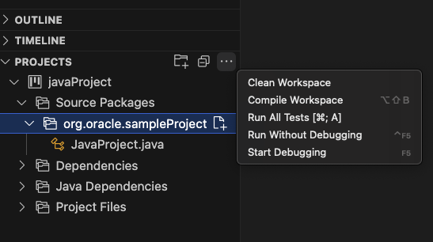

## Debugger and Launch Configurations
Language Server __Java+ ...__ launch configuration supports debugging and running Java applications using JDK11 or newer. 
1. The launch configuration (debugger) is invoked when `Run main | Debug main` code lense is selected in the code.
2. Or __Java+...__ is selected in __Run and Debug__ activity panel.  
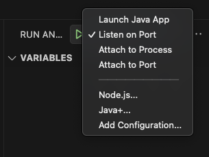
### Launch Configurations
* __Launch Java App__ - Debug or Run current Java project
* __Attach to Port__ & __Attach to Process__ - Attach debugger actions. Available when __Java+ ...__ at the bottom of drop down list is selected.
    * Select this configuration, then click the  
    * Select either from available process or enter the port to connect to JVM running with JDWP.
    * __Attach to Shared Memory__ is available on Windows in addtion to above mentioned _Attach..._

Default launch configurations provided by Language Server can modified in `launch.json` file.

### Run Configurations panel
Program arguments, VM options, evironment variables,... can be set in Run Configuration panel a part of Explorer. The panel is sufficient for all typical use-cases Java programmer faces. Only advanced, expert scenarios may require touching of `launch.json` (which still takes precedence).  
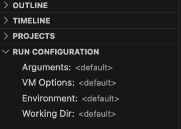 

## JDK Downloader
If the system does not detect any JDK, the extension will offer a downloader and setup prompt to help you set up a JDK. This setup provides options for Oracle JDK, OpenJDK, and allows you to choose from any installed JDK on your system.
Alternatively, you can manually specify the path to JDK binaries by utilizing the JDK downloader.
You can also access the JDK downloader through the "Download, install, and Use JDK" option in the command palette.  
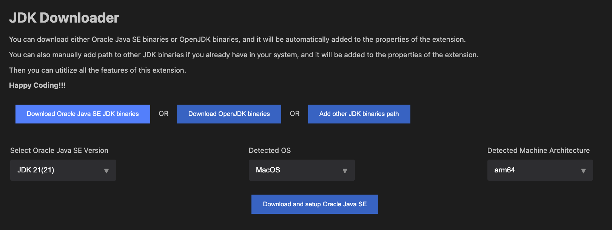 

## Supported Refactorings

Class level refactorings as well as variable refactorings are supported in VS Code via Oracle Java Platform extension. See following screenshots:

### Source Action ... context menu
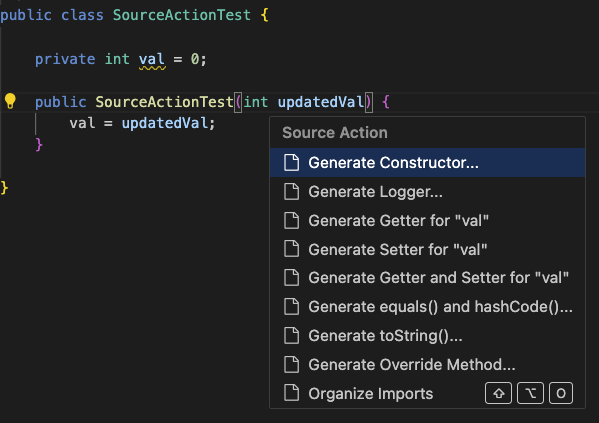 

### Introduce refactorings available via Show Code actions light bulb
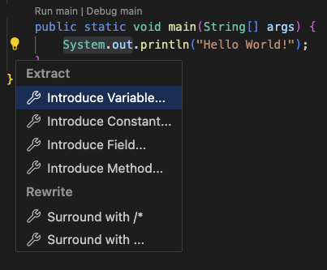

### More Refactorings available also using Refactor... context menu
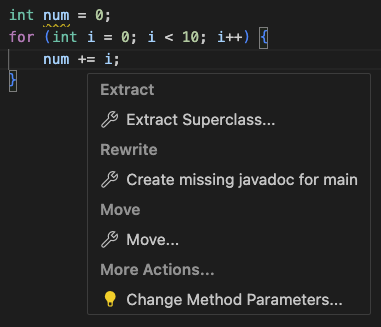

### Surround with refactorings
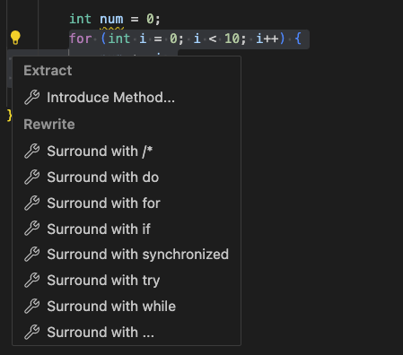

Some refactorings are two steps with like __Generate Override method__ ... where method to be overriden is selected in 2nd step:  
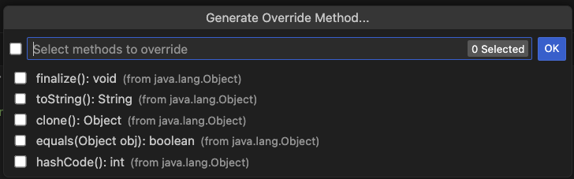

### Change Method Parameters refactoring
Change method parameters refactoring is provided using dedicated form allowing to change, add, move, remove method parameters.  
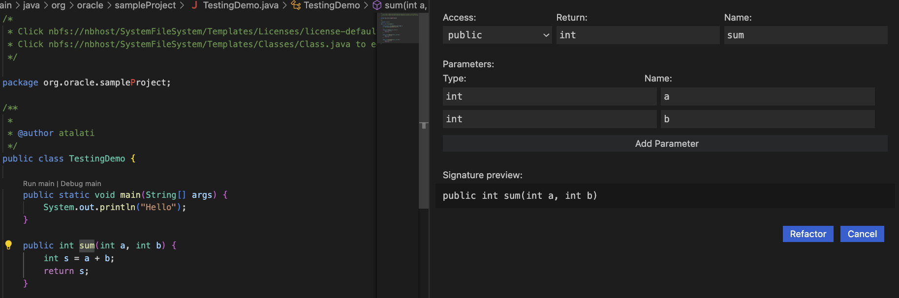

### Move Members Refactoring
Move members refactoring provides dedicated form as well.
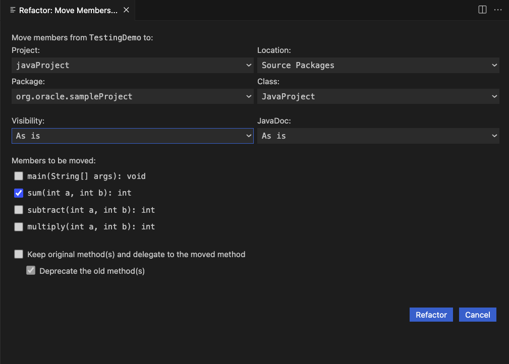

### Some of supported refactorings:
* Convert to static import 
* Pull member up & down 
* Move class 
* Extract interface/method
* Split into declaration and assignment 
* Extract local variable
* Assign to variable
* Generate hashCode/equals
* Generate toString()
* Surround With refactoring
* For cycle refactoring
* try-catch refactoring
* switch() statement
* while() cycle
* Inline redundant variable 
* Constructor and method argument refactoring

## Formatter Preferences
Easily update default formatter preferences by adjusting a simple configuration option to tailor settings according to specific needs.  

Go to VSCode `View | Command Palette | Preferences:Open User Settings | Extensions | Java`  and set `Jdk › Format: Settings Path:` option to the formatter preferences file.

Please refer to [Java formatting preferences](https://github.com/oracle/javavscode/wiki/Java-formatting-preferences) wiki for more info.

## Organize Imports
Out of the box support for organizing imports in Java sources is available. It removes unused imports, groups imports by packages and updates your imports whenever a file is saved. In addition to the defaults, there is a rich set of configuration options. 

Go to VSCode `View | Command Palette | Preferences:Open User Settings | Extensions | Java`  and search for _Jdk_ to set `Jdk > Java > Imports:` options:
* `Count For Using Star Import` - Class count to use a star-import, 999 is the default value
* `Count For Using Static Star Import` - Members count to use a static star-import, 999 is the default value
* `Groups` - Groups of import statements (specified by their package prefixes) and their sorting order. Import statements within a group are ordered alphabetically

And `View | Command Palette | Preferences:Open User Settings | Extensions > Java > On Save: Organize Imports` - Enable organize imports action on a document save

## JavaDoc smart editing
When adding JavaDoc to code Oracle Java Platform extension assists by suggesting to insert preformatted and prepopulated JavaDoc comment. Type `/**` above method signature and IDE offers to complete the JavaDoc. The action creates JavaDoc comment with all arguments prepared.  
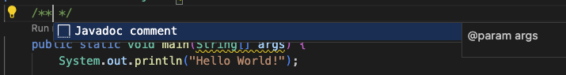

## Test Explorer
Oracle Java Platform extension provides Test Explorer view which allows to run all tests in a project, examine the results, go to source code and  run particular test.  
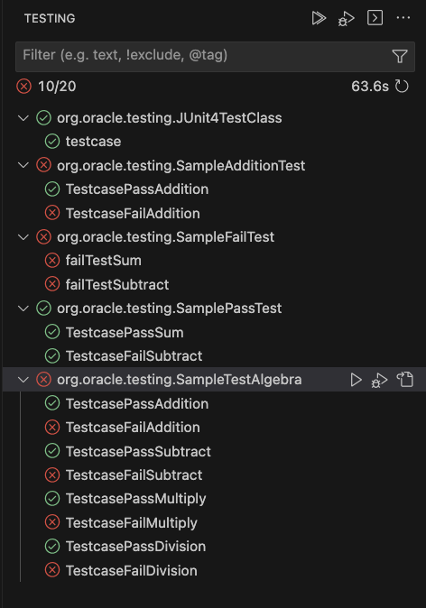

## Supported Options

* __jdk.jdkhome__ - path to the JDK, see dedicated section below
* __jdk.verbose__ - enables verbose extension logging

## Selecting the JDK

The user projects are built, run and debugged using the same JDK which runs the
Oracle Java Platform extension. The JDK is being searched in
following locations:

- `jdk.jdkhome` setting (workspace then user settings)
- `java.home` setting (workspace then user settings)
- `JDK_HOME` environment variable
- `JAVA_HOME` environment variable
- current system path

As soon as one of the settings is changed, the Language Server is restarted.

## Running Language Server per VSCode workspace or for user
It is possible to run Oracle Java Platform extension per workspace (VSCode window). This allows separation of Language Server for given project as Language Server JVM is not shared for more VSCode open workspaces (projects).
It is possible to change this in `View | Command Palette | Preferences:Open User Settings | Jdk: Userdir`. Set to `local` to use dedicated Language Server per workspace or set to `global` to have one Language Server for all VS Code workspaces.

## Contributing

This project welcomes contributions from the community. Before submitting a pull request, please [review our contribution guide](../CONTRIBUTING.md)

## Security

Please consult the [security guide](../SECURITY.md) for our responsible security vulnerability disclosure process

## License

Copyright (c) 2023 Oracle and/or its affiliates.

Oracle Java Platform Extension for Visual Studio Code is licensed under [Apache 2.0 License](../LICENSE.txt). 
The [THIRD_PARTY_LICENSES](../THIRD_PARTY_LICENSES.txt) file contains third party notices and licenses.
